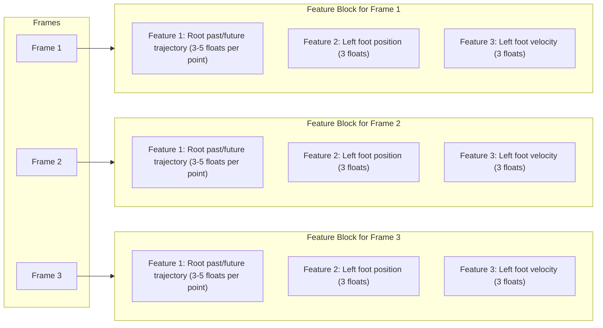

# Motion Matching for Godot 4.3

A motion matching implementation in Godot 4.3, implemented following [Dan Holden's article](https://www.theorangeduck.com/page/code-vs-data-driven-displacement). 

:warning: **This repo is a work in progress!** :warning:

### Demo
The demo has now moved to a separate repository. You can find it [here!](https://github.com/GuilhermeGSousa/godot-motion-matching-demo).

### Wiki
[You can find this repo's wiki here!](https://github.com/GuilhermeGSousa/godot-motion-matching/wiki)

### Features
You'll find on this repo:
- A plugin that allow you to run motion matching queries on an animation dataset!
- A `CharacterBody3D` implementing a simple movement logic.
- Trajectory generation, including collisions and environmental checks.
- An editor to bake and visualize motion matching features.
- Blending nodes to qllow you to smoothly transition when switching animations.

### Credits

- [Road to Next Gen Animation - GDC Talk](https://www.gdcvault.com/play/1023280/Motion-Matching-and-The-Road)
- [Simon Clavet's implementation video](https://www.youtube.com/watch?v=jcpIrw38E-s&ab_channel=SimonClavet)
- [Orange Duck's Blog](https://theorangeduck.com/)
- [Remi's Motion Matching implementation](https://github.com/Remi123/MotionMatching)
- Demo data taken from [O3DE Motion Matching Implementation](https://github.com/o3de/o3de/tree/development/Gems/MotionMatching)

### What is motion matching?

Motion Matching is a technique that allows us to jump from any frame of any animation to any frame of any other animation. Like an over-complicated state machine if you'd like! Motion matching works in two parts baking and runtime.

Baking describes the process of creating a database from all our animations that we can query at runtime based on what's going on in the game to give us the animation frame that best fits the current in-game state.

This is done by generating a big NxM matrix (what we call motion_data in MMLibrary), where:

N = total number of frames on all our animations

M = sum of the dimensions of all features

Where a feature is simply something that describes whats going on. It could be the character's velocity (dimension 3) or the following three positions of the character in the future (dimension 3 * 3)

This results in something like this (see Figure 1)
 
Now that we have our database, we can find the best animation for what's happening in the game. To do this, we only need to compute a vector of dimension M with the same information as a row from the matrix in Figure 1. The difference is that instead of making this array from animation data, we must find a way to use information from the character and the level around it.

Once we have this vector, all we need to do is compute the vector distance between it and each of the lines of the matrix. Whoever has the lowest error wins! We then play that animation at that frame.

